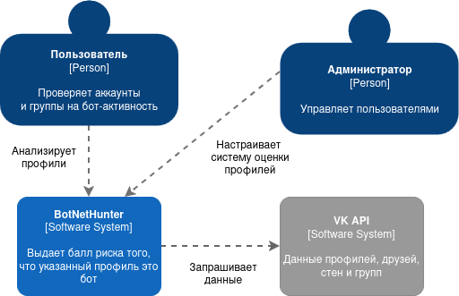
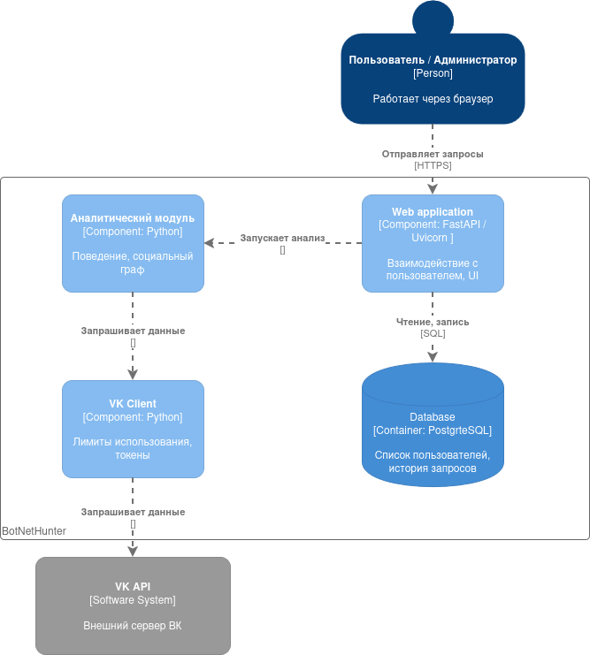
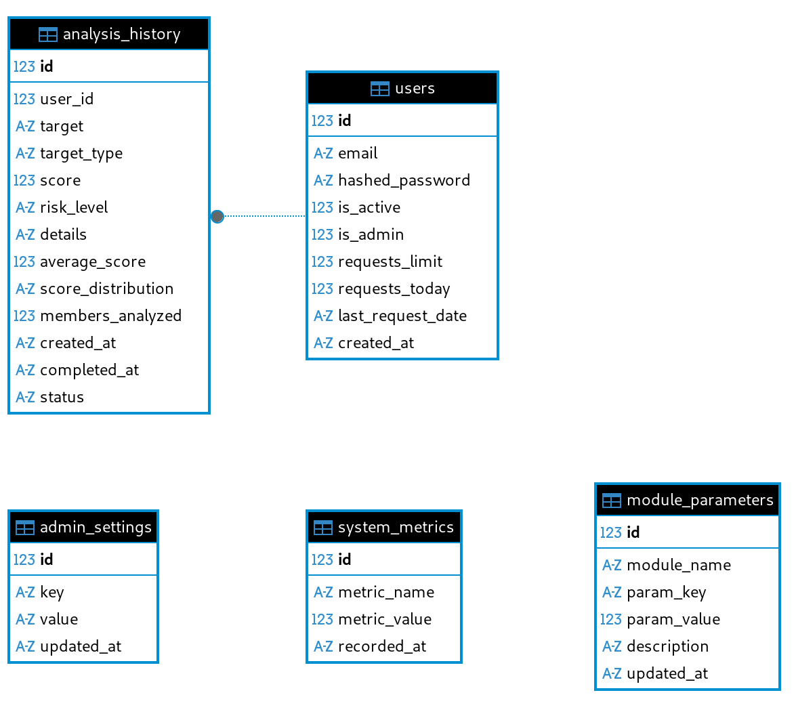
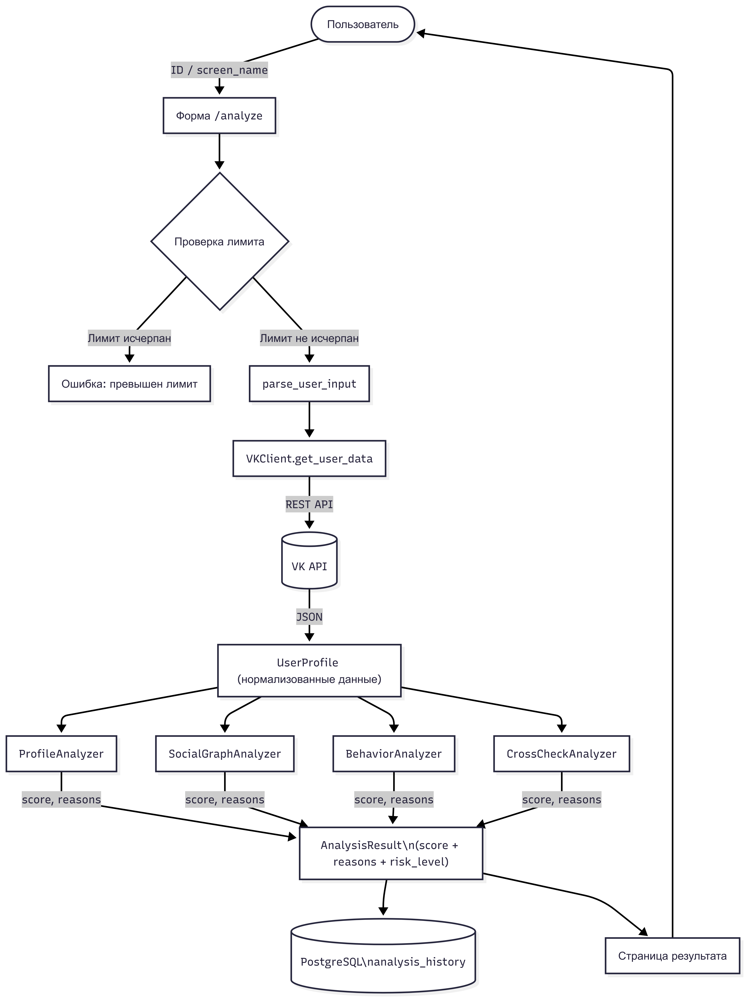

# Описание системы — BotNetHunter

## Структура ПО

Перечень программных компонентов с указанием роли в системе:

1. **Python 3.11** — среда исполнения всего серверного кода.
2. **FastAPI 0.104+** — веб-фреймворк; обрабатывает HTTP-запросы, управляет маршрутизацией, рендерит шаблоны через Jinja2.
3. **Uvicorn 0.24+** — ASGI-сервер; запускает приложение FastAPI и обслуживает входящие соединения.
4. **PostgreSQL 16+** — серверная реляционная СУБД; хранит пользователей, историю анализа, настройки и метрики системы.
5. **SQLAlchemy 2.0+** — ORM-слой; абстрагирует работу с БД, управляет сессиями и миграциями схемы.
6. **Модуль `analyzers/`** — четыре аналитических компонента (`ProfileAnalyzer`, `SocialGraphAnalyzer`, `BehaviorAnalyzer`, `CrossCheckAnalyzer`), каждый независимо начисляет штрафные баллы и формирует список факторов.
7. **Модуль `core/`** — `VKClient` (HTTP-клиент к VK API с rate-limiting и retry-логикой) и `TokenManager` (пул VK API-токенов с round-robin ротацией).
8. **VK API v5.131** — внешний сервис; предоставляет данные профилей, списков друзей, стен и участников групп.
9. **Jinja2 3.1+** — шаблонизатор HTML; генерирует страницы пользовательского интерфейса.
10. **argon2-cffi + PyJWT** — компоненты безопасности: хэширование паролей (Argon2id) и выдача/проверка JWT-токенов (HS256).

---
## Структурная схема ПО в нотации C4

### Уровень контекста (System Context)

---

### Уровень контейнеров (Containers)

---

## Схемы баз данных (ERD)

---

## Функциональная схема ПО (DFD) Диаграмма потоков данных для основного сценария — **анализ профиля пользователя**.

