# Руководство пользователя BotNetHunter

## Содержание

1. [Введение](#1-введение)
2. [Назначение и условия применения](#2-назначение-и-условия-применения)
3. [Подготовка к работе](#3-подготовка-к-работе)
4. [Описание операций — Пользователь](#4-описание-операций--роль-пользователь)
   - 4.1 [Регистрация в системе](#41-регистрация-в-системе)
   - 4.2 [Авторизация в системе](#42-авторизация-в-системе)
   - 4.3 [Запуск анализа группы ВКонтакте](#43-запуск-анализа-группы-вконтакте)
   - 4.4 [Просмотр результата анализа](#44-просмотр-результата-анализа)
   - 4.5 [Просмотр истории проверок](#45-просмотр-истории-проверок)
   - 4.6 [Смена пароля](#46-смена-пароля)
   - 4.7 [Подключение двухфакторной аутентификации](#47-подключение-двухфакторной-аутентификации)
   - 4.8 [Отключение двухфакторной аутентификации](#48-отключение-двухфакторной-аутентификации)
   - 4.9 [Удаление аккаунта](#49-удаление-аккаунта)
   - 4.10 [Смена аватара](#410-смена-аватара)
   - 4.11 [Выход из системы](#411-выход-из-системы)
5. [Описание операций — Администратор](#5-описание-операций--роль-администратор)
   - 5.1 [Авторизация администратора](#51-авторизация-администратора)
   - 5.2 [Просмотр обзора системы](#52-просмотр-обзора-системы)
   - 5.3 [Управление пользователями](#53-управление-пользователями)
   - 5.4 [Блокировка и разблокировка пользователя](#54-блокировка-и-разблокировка-пользователя)
   - 5.5 [Изменение лимита запросов пользователя](#55-изменение-лимита-запросов-пользователя)
   - 5.6 [Управление VK API токенами](#56-управление-vk-api-токенами)
   - 5.7 [Настройка весов аналитических модулей](#57-настройка-весов-аналитических-модулей)
   - 5.8 [Настройка параметров аналитических модулей](#58-настройка-параметров-аналитических-модулей)
   - 5.9 [Просмотр системных метрик](#59-просмотр-системных-метрик)
6. [Сообщения об ошибках](#6-сообщения-об-ошибках)
7. [Аварийные ситуации](#7-аварийные-ситуации)
8. [Рекомендации по освоению](#8-рекомендации-по-освоению)

## 1 Введение

Настоящее руководство предназначено для пользователей системы **BotNetHunter** — веб-приложения для анализа профилей и сообществ ВКонтакте на признаки ботоподобного поведения.

Система поддерживает две роли:

- **Пользователь** — зарегистрированный участник, выполняющий проверки профилей и групп ВКонтакте.
- **Администратор** — привилегированная учётная запись, управляющая пользователями, токенами VK API и параметрами анализаторов.

Руководство описывает все операции, доступные каждой роли, в требуемой последовательности действий.

## 2 Назначение и условия применения

**Назначение системы.** BotNetHunter автоматически оценивает вероятность того, что аккаунт ВКонтакте или участники сообщества являются ботами, спам-аккаунтами или искусственно созданными учётными записями. Оценка производится на основе данных VK API с применением аналитических модулей: анализа профиля, поведенческого анализа и выявления координированной активности.

**Условия применения:**

| Параметр | Требование |
|---|---|
| Браузер | Chrome, Firefox, Safari, Edge (актуальные версии) |
| Сеть | Доступ к интернету (для обращения к VK API) |
| Учётная запись | Зарегистрированный аккаунт в системе BotNetHunter |
| VK API токены | Не менее одного активного токена, добавленного администратором |

## 3 Подготовка к работе

1. Открыть браузер и перейти по адресу системы `https://botnethunter.duckdns.org`.
2. Убедиться, что страница входа отображается корректно (отсутствуют ошибки 4xx и 5xx).
3. При первом использовании — пройти регистрацию (операция 4.1).
4. Подготовить ссылку на профиль или группу, анализ которой необходимо выполнить.

## 4 Описание операций — роль "Пользователь"

### 4.1 Регистрация в системе

**Наименование:** Регистрация нового пользователя.

**Условия выполнения:**
- Система доступна (отсутствуют ошибки 4xx и 5xx).
- Адрес электронной почты не используется в системе.

**Подготовительные действия:**
- Подготовить адрес электронной почты и пароль длиной не менее 8 символов.

**Основные действия:**
1. Открыть в браузере страницу `/register` или перейти по ссылке «Создать аккаунт» на странице входа.
2. В поле **Email** ввести адрес электронной почты.
3. В поле **Пароль** ввести пароль (минимум 8 символов).
4. Нажать кнопку **Зарегистрироваться**.

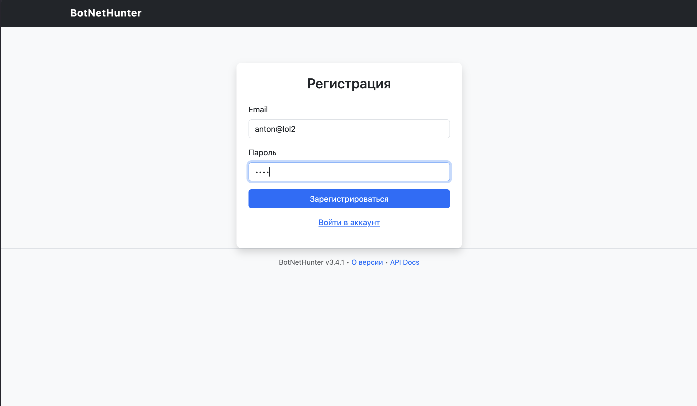

*Рисунок 1 — Форма регистрации нового пользователя*

**Заключительные действия:**
- При успешной регистрации система перенаправит на страницу входа.
- Если email уже зарегистрирован, на странице отобразится сообщение об ошибке — необходимо исправить данные и повторить попытку.

### 4.2 Авторизация в системе

**Наименование:** Авторизация пользователя в системе.

**Условия выполнения:**
- Учётная запись создана и не заблокирована администратором.
- Система доступна.

**Подготовительные действия:**
- Знать email и пароль, указанные при регистрации.

**Основные действия:**
1. Открыть в браузере стартовую страницу системы `/`.
2. В поле **Email** ввести адрес электронной почты.
3. В поле **Пароль** ввести пароль.
4. Нажать кнопку **Войти**.

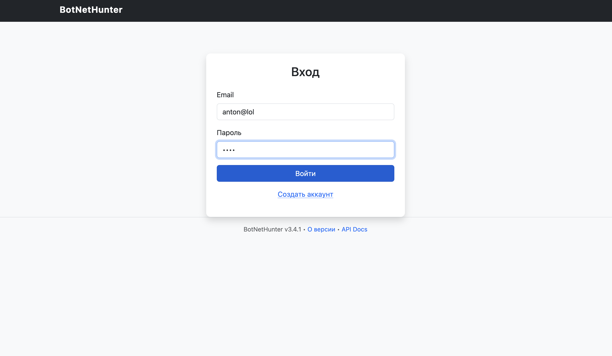

*Рисунок 2 — Форма входа в систему*

**Заключительные действия:**
- При успешной авторизации (2FA не подключена) система перенаправит в личный кабинет (`/dashboard`).
- Если для учётной записи включена двухфакторная аутентификация, система перенаправит на страницу `/login/2fa`, где необходимо ввести 6-значный OTP-код из приложения-аутентификатора.

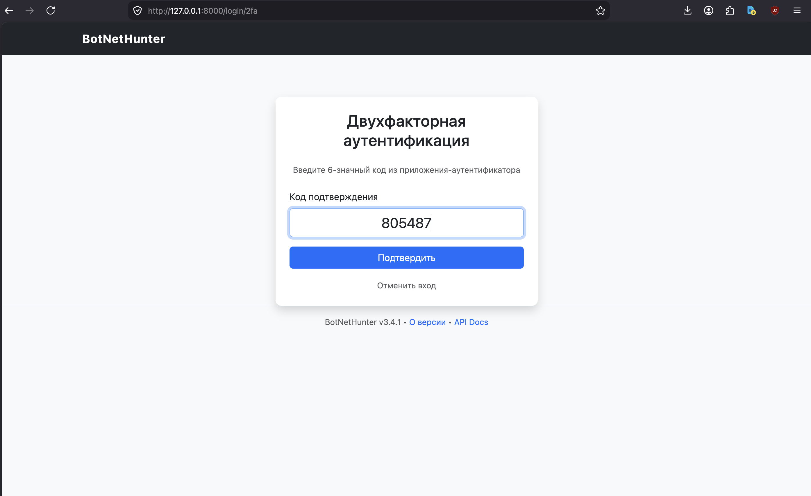

*Рисунок 3 — Форма ввода одноразового кода при двухфакторной аутентификации*

- При неверных учётных данных отобразится сообщение «Неверный email или пароль».
- При заблокированной учётной записи отобразится сообщение «Аккаунт заблокирован».

### 4.3 Запуск анализа группы ВКонтакте

**Наименование:** Анализ сообщества ВКонтакте на признаки ботоподобной активности участников.

**Условия выполнения:**
- Пользователь авторизован в системе.
- Дневной лимит запросов не исчерпан (для групп каждый проанализированный участник расходует одну единицу лимита).
- Администратор добавил хотя бы один активный VK API токен.
- Группа ВКонтакте является открытой.

**Подготовительные действия:**
- Определить идентификатор сообщества ВКонтакте: username (`club1`), `public`-ID, `event`-ID или ссылка (`https://vk.com/some_group`).

**Основные действия:**
1. Перейти в личный кабинет (`/dashboard`).
2. В поле **Ссылка, ID или username** ввести идентификатор группы.
3. В переключателе **Тип цели** выбрать значение **Группа**.
4. Нажать кнопку **Запустить проверку**.
5. Дождаться завершения анализа. Кнопка перейдёт в состояние «Анализ выполняется…».

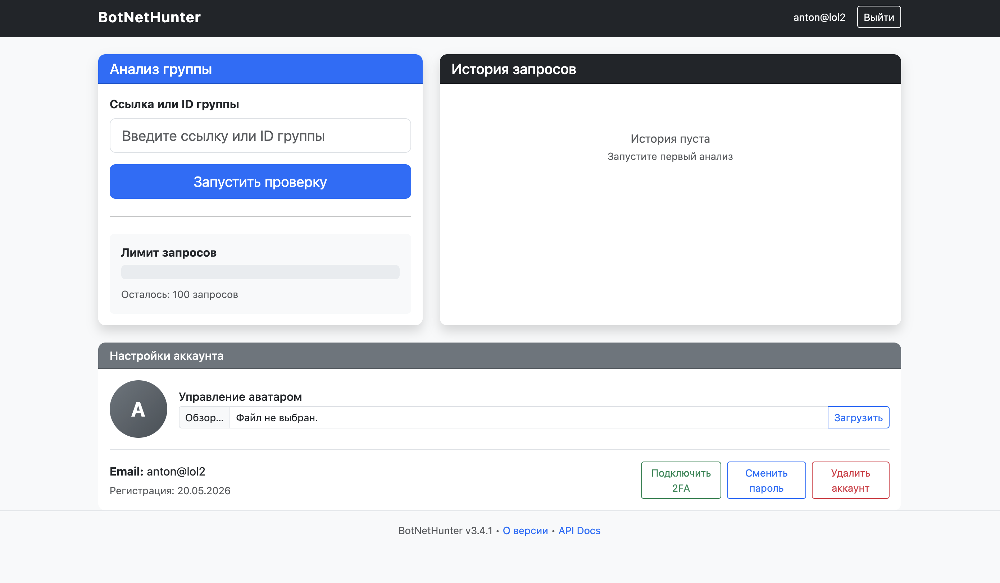

*Рисунок 4 — Личный кабинет пользователя*

**Заключительные действия:**
- После завершения система откроет страницу результата `/history/{id}` со средним баллом риска по группе, количеством проанализированных постов и участников, сводкой по нарушениям.
- Счётчик использованных запросов увеличивается на количество проанализированных участников.

### 4.4 Просмотр результата анализа

**Наименование:** Просмотр детализированного отчёта по выполненной проверке.

**Условия выполнения:**
- Пользователь авторизован в системе.
- Анализ успешно завершён (статус `completed`).

**Подготовительные действия:** Отсутствуют.

**Основные действия:**
1. В разделе **История запросов** на дашборде найти нужную запись.
2. Нажать кнопку **Подробнее** или перейти по ссылке `/history/{id}`.

**Заключительные действия:**
- Страница отображает итоговый балл риска (0–100), уровень риска, перечень обнаруженных аномалий.

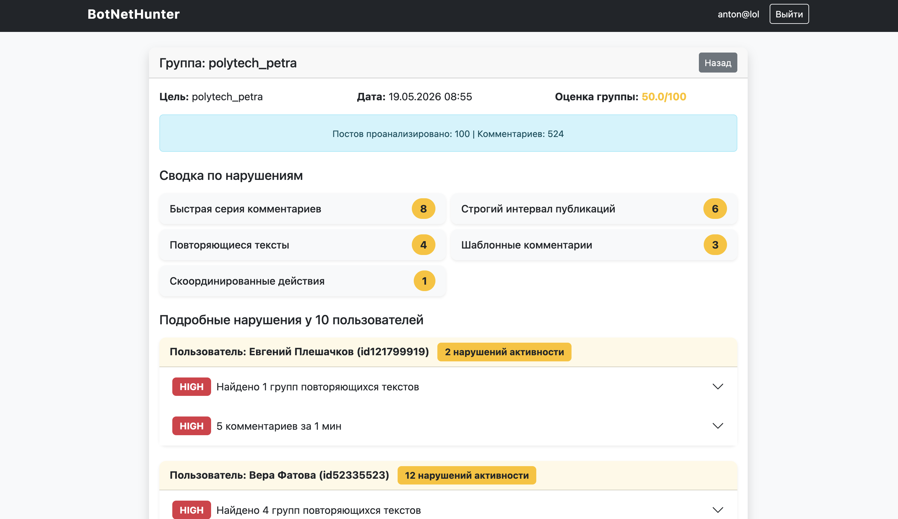

*Рисунок 5 — Результат анализа группы: итоговый балл и распределение по участникам*

В числе выявляемых аномалий — одинаковые комментарии от разных аккаунтов под одной публикацией:

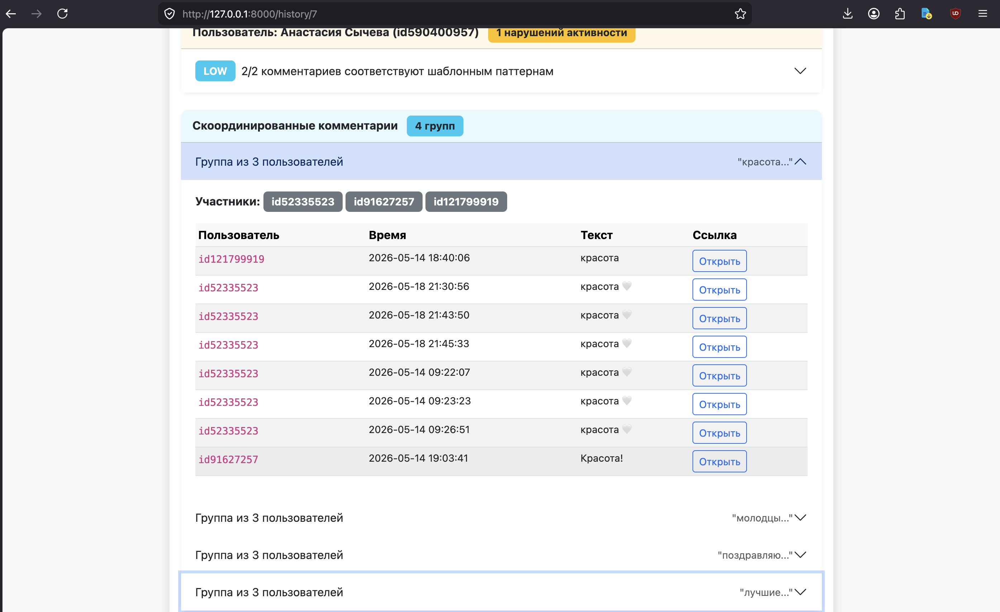

*Рисунок 6 — Обнаружение повторяющихся текстов от разных пользователей под одним постом*

Также шаблонные публикации одного пользователя в разных постах группы:

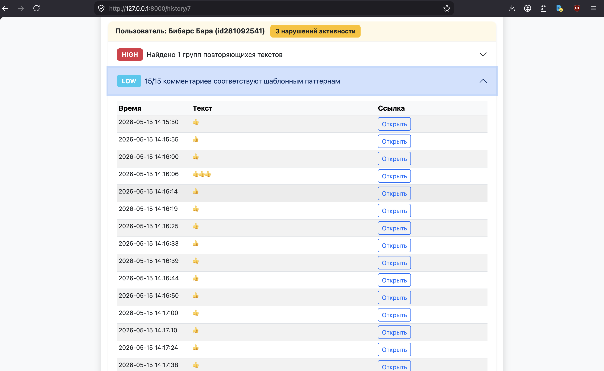

*Рисунок 7 — Шаблонные комментарии одного аккаунта в разных публикациях группы*

### 4.5 Просмотр истории проверок

**Наименование:** Просмотр ранее выполненных проверок.

**Условия выполнения:**
- Пользователь авторизован в системе.

**Подготовительные действия:** Отсутствуют.

**Основные действия:**
1. Перейти на страницу `/dashboard`.
2. В разделе **История запросов** отображается список всех выполненных проверок.
3. Для каждой записи отображаются: цель, тип, дата, статус и уровень риска.

**Заключительные действия:**
- При необходимости открыть детализированный отчёт, нажав **Подробнее** рядом с нужной записью (операция 4.4).

### 4.6 Смена пароля

**Наименование:** Изменение пароля учётной записи пользователя.

**Условия выполнения:**
- Пользователь авторизован в системе.

**Подготовительные действия:**
- Подготовить текущий пароль и новый пароль длиной не менее 8 символов.

**Основные действия:**
1. На дашборде нажать кнопку **Сменить пароль** (или перейти по URL `/account/change-password`).
2. В поле **Текущий пароль** ввести действующий пароль.
3. В поле **Новый пароль** ввести новый пароль (минимум 8 символов).
4. В поле **Повторите новый пароль** ввести новый пароль ещё раз.
5. Нажать кнопку **Сохранить новый пароль**.

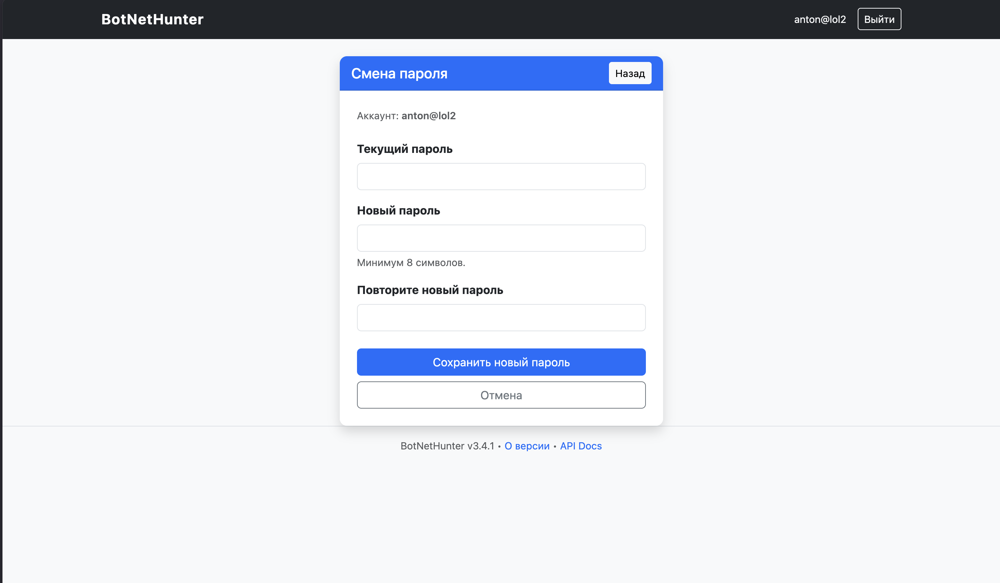

*Рисунок 8 — Форма смены пароля*

**Заключительные действия:**
- При успешной смене пароля система отобразит сообщение об успехе и перенаправит на дашборд.
- При несовпадении паролей или неверном текущем пароле отобразится сообщение об ошибке.

### 4.7 Подключение двухфакторной аутентификации

**Наименование:** Включение двухфакторной аутентификации (2FA) для учётной записи пользователя.

**Условия выполнения:**
- Пользователь авторизован в системе.
- Двухфакторная аутентификация ещё не подключена.
- На устройстве установлено приложение-аутентификатор (Google Authenticator, Яндекс Ключ, Authy или аналогичное).

**Подготовительные действия:**
- Установить приложение-аутентификатор, поддерживающее протокол TOTP (RFC 6238).

**Основные действия:**
1. На странице `/dashboard` нажать кнопку **Подключить 2FA**.
2. Система откроет страницу `/account/2fa/setup` с QR-кодом и текстовым ключом.
3. Отсканировать QR-код камерой приложения-аутентификатора **или** ввести текстовый ключ вручную через меню «+» → «Ввести ключ».
4. В поле **Введите 6-значный код из приложения** ввести актуальный OTP-код.
5. Нажать кнопку **Подтвердить и включить 2FA**.

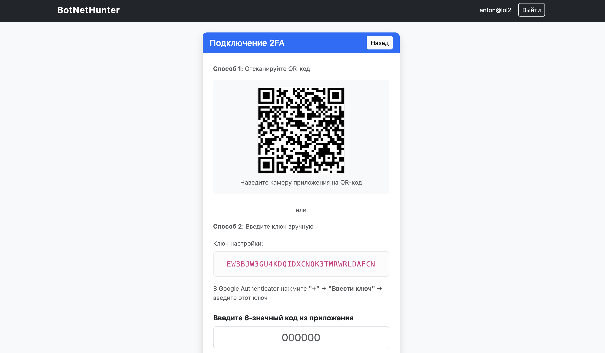

*Рисунок 9 — Страница привязки TOTP-аутентификатора: QR-код и ручной ввод секрета*

**Заключительные действия:**
- При успешном подтверждении 2FA активируется: на дашборде отобразится метка «2FA активна».
- При вводе неверного кода система отобразит сообщение об ошибке — необходимо дождаться обновления кода в приложении и повторить попытку.
- После подключения каждый последующий вход потребует ввода OTP-кода (см. рисунок 3).

### 4.8 Отключение двухфакторной аутентификации

**Наименование:** Отключение двухфакторной аутентификации для учётной записи пользователя.

**Условия выполнения:**
- Пользователь авторизован в системе.
- Двухфакторная аутентификация ранее была подключена.

**Подготовительные действия:** Отсутствуют.

**Основные действия:**
1. На странице `/dashboard` нажать кнопку **Отключить 2FA**.
2. Подтвердить действие в диалоговом окне.

**Заключительные действия:**
- 2FA отключается, метка «2FA активна» исчезает с дашборда.
- При следующем входе ввод OTP-кода не потребуется.

### 4.9 Удаление аккаунта

**Наименование:** Удаление учётной записи пользователя из системы.

**Условия выполнения:**
- Пользователь авторизован в системе.
- Учётная запись не является административной.

**Подготовительные действия:** Отсутствуют.

**Основные действия:**
1. На дашборде нажать кнопку **Удалить аккаунт**.
2. Подтвердить удаление в диалоговом окне.

**Заключительные действия:**
- Учётная запись и связанная история проверок удаляются из базы данных.
- Система перенаправляет на страницу входа.

### 4.10 Смена аватара

**Наименование:** Загрузка фотографии профиля пользователя.

**Условия выполнения:**
- Пользователь авторизован в системе.

**Подготовительные действия:**
- Подготовить файл изображения на устройстве.

**Основные действия:**
1. На странице `/dashboard` нажать кнопку смены аватара.
2. В открывшемся диалоге выбрать файл изображения на устройстве.
3. Подтвердить выбор.

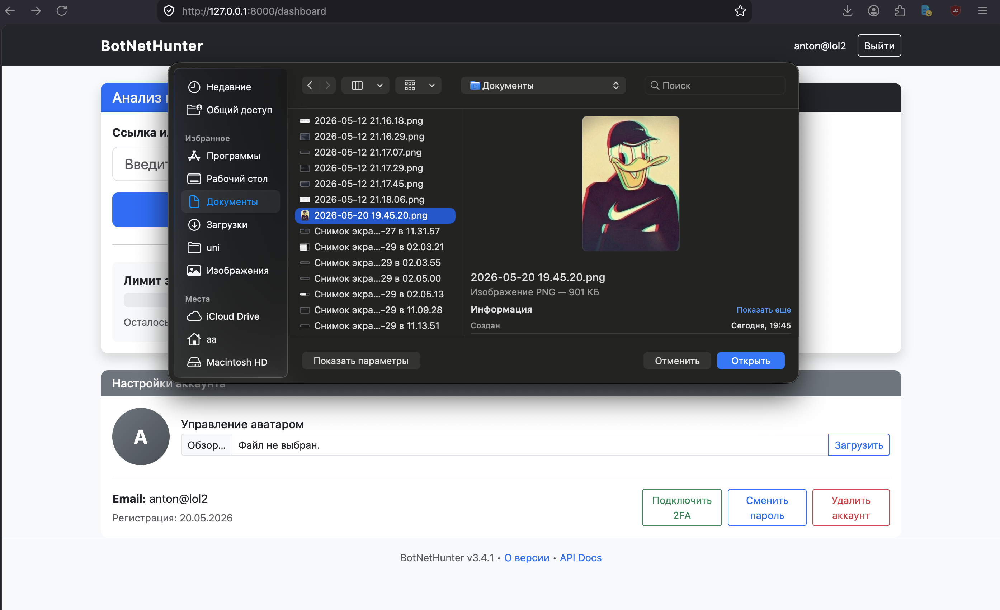

*Рисунок 10 — Диалог выбора файла аватара*

**Заключительные действия:**
- Новый аватар отображается в профиле и навигационном меню.

### 4.11 Выход из системы

**Наименование:** Завершение сеанса работы с системой.

**Условия выполнения:**
- Пользователь авторизован в системе.

**Подготовительные действия:** Отсутствуют.

**Основные действия:**
1. Перейти по ссылке `/logout` или нажать кнопку **Выйти** в интерфейсе.

**Заключительные действия:**
- Сессионный токен сбрасывается. Система перенаправляет на страницу входа `/`.
- При попытке обратиться к защищённым страницам без повторной авторизации произойдёт перенаправление на страницу входа.

## 5 Описание операций — роль "Администратор"

### 5.1 Авторизация администратора

**Наименование:** Вход в систему с правами администратора.

**Условия выполнения:**
- Учётные данные администратора (`ADMIN_EMAIL`, `ADMIN_PASSWORD`) настроены в конфигурации системы.
- Система запущена и доступна.

**Подготовительные действия:**
- Иметь учётные данные администратора.

**Основные действия:**
1. Открыть стартовую страницу `/`.
2. Ввести email и пароль администратора.
3. Нажать кнопку **Войти**.

**Заключительные действия:**
- При успешной авторизации система перенаправит в панель администратора `/admin`.
- Интерфейс администратора включает разделы: Обзор, Пользователи, VK Токены, Веса модулей, Параметры, Метрики.

### 5.2 Просмотр обзора системы

**Наименование:** Просмотр сводной статистики работы системы.

**Условия выполнения:**
- Администратор авторизован в системе.

**Подготовительные действия:** Отсутствуют.

**Основные действия:**
1. Перейти в раздел `/admin`.

**Заключительные действия:**
- Страница отображает ключевые показатели: общее число пользователей, количество запросов за сегодня, средний балл риска, нагрузку VK API и число активных токенов.

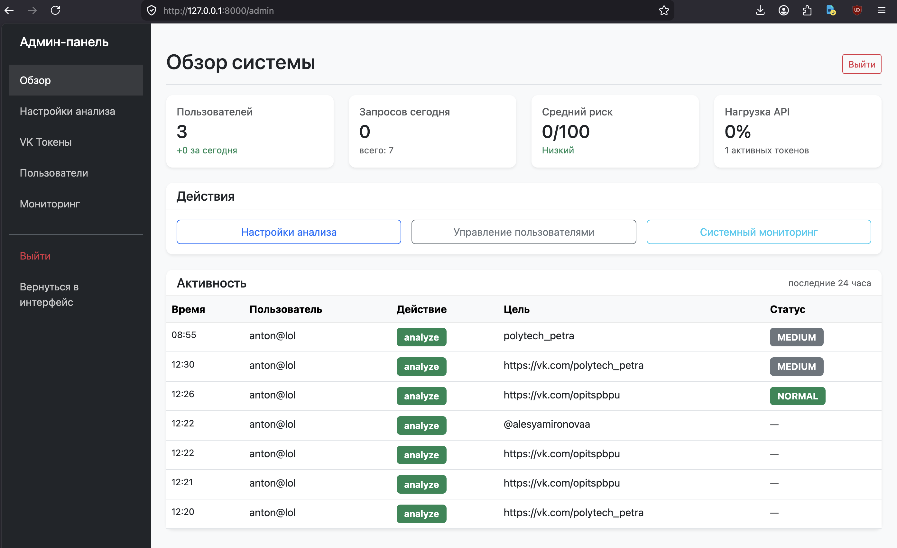

*Рисунок 11 — Сводная статистика в панели администратора*

### 5.3 Управление пользователями

**Наименование:** Просмотр и фильтрация списка зарегистрированных пользователей.

**Условия выполнения:**
- Администратор авторизован в системе.

**Подготовительные действия:** Отсутствуют.

**Основные действия:**
1. Перейти в раздел `/admin/users`.
2. Для поиска по email использовать поле **Поиск по email** в верхней части.
3. Для фильтрации по статусу (Все / Активные / Заблокированные / Администраторы) использовать выпадающий список **Статус**.
4. Нажать кнопку **Применить** для применения фильтров или **Сбросить** для возврата к полному списку.

**Заключительные действия:**
- В таблице отображаются ID, email, статус, количество запросов за сегодня, лимит и дата регистрации каждого пользователя.

### 5.4 Блокировка и разблокировка пользователя

**Наименование:** Ограничение или восстановление доступа пользователя к системе.

**Условия выполнения:**
- Администратор авторизован в системе.
- Целевая учётная запись существует и не является учётной записью администратора.

**Подготовительные действия:** Отсутствуют.

**Основные действия (блокировка):**
1. Перейти в раздел `/admin/users`.
2. В строке нужного пользователя нажать кнопку **Заблокировать**.
3. Подтвердить действие в диалоговом окне.

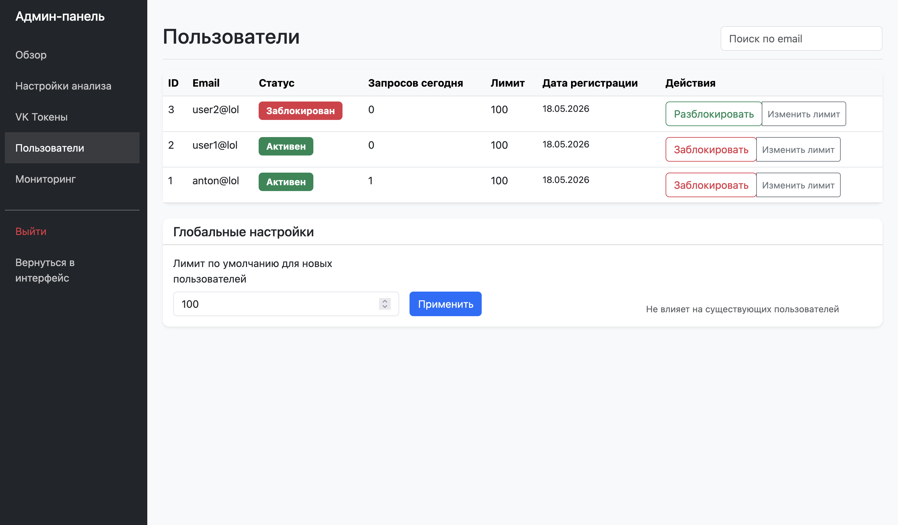

*Рисунок 12 — Статус пользователя после блокировки*

**Основные действия (разблокировка):**
1. Перейти в раздел `/admin/users`.
2. В строке заблокированного пользователя нажать кнопку **Разблокировать**.

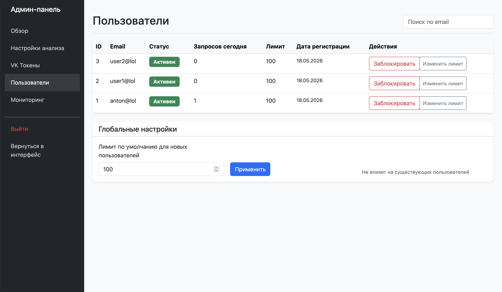

*Рисунок 13 — Статус пользователя после снятия блокировки*

**Заключительные действия:**
- Статус пользователя в таблице изменится на «Заблокирован» или «Активен».
- Заблокированный пользователь при попытке входа получит сообщение «Аккаунт заблокирован».

### 5.5 Изменение лимита запросов пользователя

**Наименование:** Установка индивидуального дневного лимита анализов для пользователя.

**Условия выполнения:**
- Администратор авторизован в системе.
- Целевая учётная запись существует.

**Подготовительные действия:**
- Определить новое значение лимита.

**Основные действия:**
1. Перейти в раздел `/admin/users`.
2. В строке нужного пользователя найти поле ввода лимита.
3. Ввести новое значение лимита.
4. Нажать кнопку **Сохранить** рядом с полем.

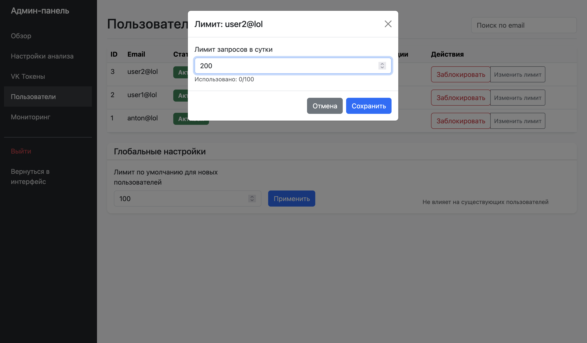

*Рисунок 14 — Изменение лимита запросов пользователя*

**Заключительные действия:**
- Новый лимит отображается в столбце **Лимит** таблицы пользователей и вступает в силу немедленно.

### 5.6 Управление VK API токенами

**Наименование:** Добавление, деактивация и удаление токенов доступа к VK API.

**Условия выполнения:**
- Администратор авторизован в системе.
- Токен VK API получен на https://vk.com/dev.

**Подготовительные действия:**
- Иметь строку токена доступа VK API в формате `vk1.a.XXXXX...`.

**Основные действия (добавление токена):**
1. Перейти в раздел `/admin/tokens`.
2. В поле **VK Token** вставить строку токена.
3. При необходимости заполнить поле **Описание**.
4. Нажать кнопку **Добавить токен**.

**Основные действия (деактивация/удаление токена):**
1. Перейти в раздел `/admin/tokens`.
2. В таблице токенов найти нужный токен.
3. Нажать кнопку **Выключить** для временного отключения или **Удалить** для удаления.

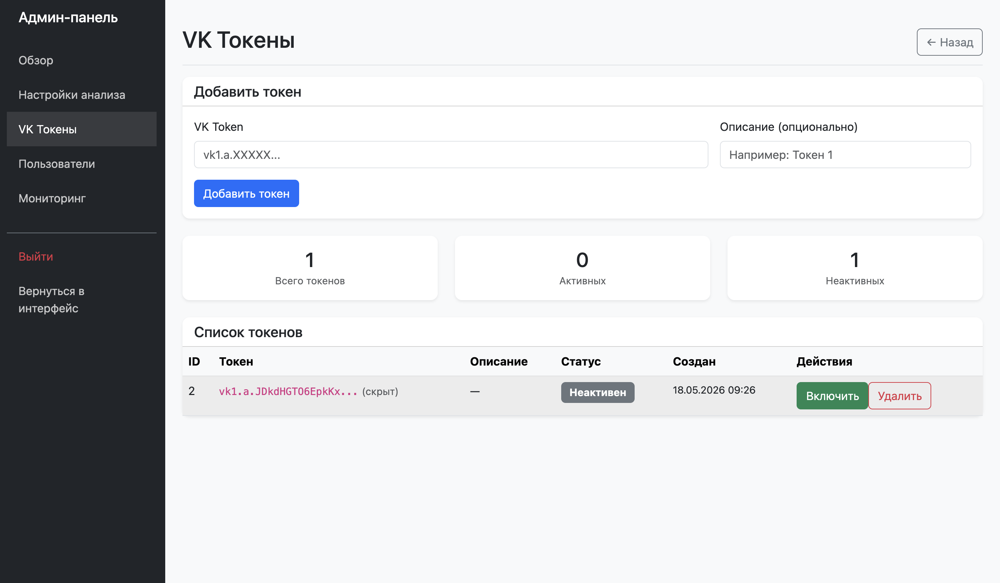

*Рисунок 15 — Токен VK API в отключённом состоянии*

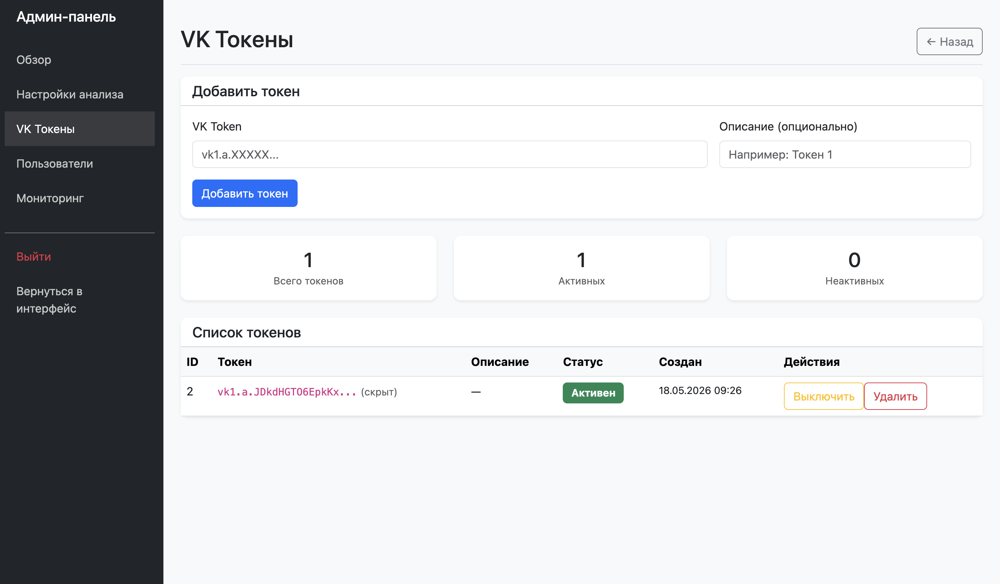

*Рисунок 16 — Токен VK API в активном состоянии*

**Заключительные действия:**
- Добавленный токен отображается в таблице со статусом «Активен» и сразу включается в ротацию запросов.

### 5.7 Настройка весов аналитических модулей

**Наименование:** Изменение весовых коэффициентов аналитических модулей, влияющих на итоговый балл риска.

**Условия выполнения:**
- Администратор авторизован в системе.

**Подготовительные действия:** Отсутствуют.

**Основные действия:**
1. Перейти в раздел `/admin/weights`.
2. Изменить значения весов в соответствующих полях ввода для нужных модулей.
3. Нажать кнопку **Сохранить** для применения изменений.
4. При необходимости вернуть стандартные значения, нажав кнопку **Сбросить**.

**Заключительные действия:**
- Новые веса сохраняются в базе данных и применяются ко всем последующим анализам.

### 5.8 Настройка параметров аналитических модулей

**Наименование:** Изменение числовых параметров работы аналитических модулей.

**Условия выполнения:**
- Администратор авторизован в системе.

**Подготовительные действия:** Отсутствуют.

**Основные действия:**
1. Перейти в раздел `/admin/weights/parameters`.
2. Изменить значения нужных параметров: порог схожести комментариев, временное окно активности, порог новизны аккаунта и другие.
3. Нажать кнопку **Сохранить**.

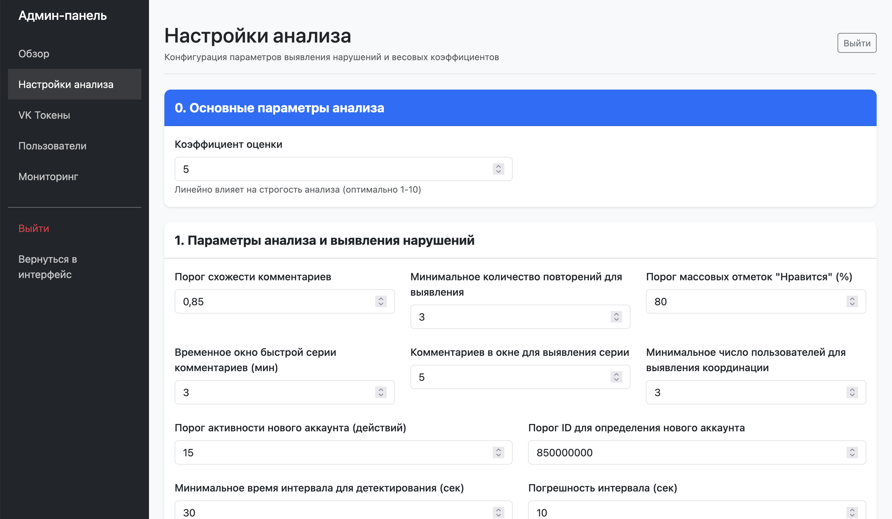

*Рисунок 17 — Настройка параметров аналитических модулей*

**Заключительные действия:**
- Параметры сохраняются в базе данных и применяются к последующим анализам без перезапуска сервиса.

### 5.9 Просмотр системных метрик

**Наименование:** Мониторинг технических показателей работы системы.

**Условия выполнения:**
- Администратор авторизован в системе.

**Подготовительные действия:** Отсутствуют.

**Основные действия:**
1. Перейти в раздел `/admin/metrics`.

**Заключительные действия:**
- Страница отображает системные метрики: использование CPU и памяти, статистику по запросам к VK API, информацию о версии приложения.

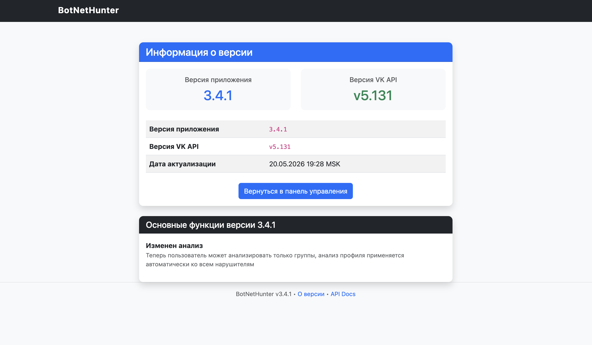

*Рисунок 18 — Версия приложения и VK API*

Для расширенного мониторинга в профиле развёртывания доступен дашборд Grafana по адресу `/grafana/`. Он отображает временные ряды загрузки процессора, памяти и сетевой активности на основе данных Prometheus.

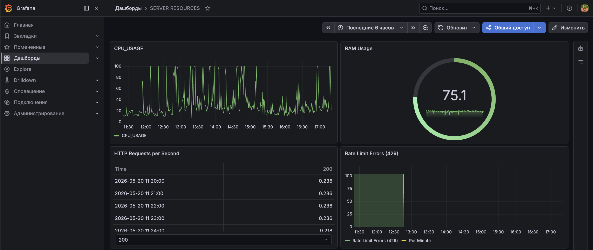

*Рисунок 19 — График загрузки CPU в дашборде Grafana*

## 6 Сообщения об ошибках

| Сообщение | Причина | Действие пользователя |
|---|---|---|
| Неверный email или пароль | Введены некорректные учётные данные | Проверить правильность ввода email и пароля |
| Аккаунт заблокирован | Администратор заблокировал учётную запись | Обратиться к администратору системы |
| Лимит исчерпан | Достигнут дневной лимит проверок | Ожидать обнуления лимита в 00:00 или обратиться к администратору |
| VK токены не заданы | В панели администратора нет активных токенов VK API | Обратиться к администратору для добавления токена |
| Не удалось получить данные профиля | Профиль не найден, закрыт или VK API вернул ошибку | Убедиться в правильности идентификатора, проверить публичность профиля |
| Не удалось получить участников группы | Группа не найдена или закрыта | Убедиться в правильности идентификатора, проверить публичность группы |
| Email уже зарегистрирован | При регистрации указан уже существующий email | Использовать другой email или восстановить доступ к существующему аккаунту |

Пример отображения ошибки при некорректном токене ВКонтакте:

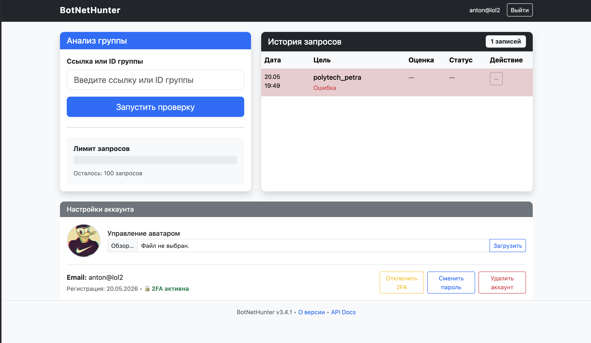

*Рисунок 20 — Сообщение об ошибке при попытке выполнить запрос с некорректным токеном ВК*

## 7 Аварийные ситуации

**Наименование:** Действия пользователя при возникновении нештатных ситуаций.

**Общие положения:** Аварийные ситуации возникают при нарушении нормальной работы системы, недоступности сервисов или ошибках обработки данных.

### 7.1 Недоступность системы

**Признаки:** Страница не загружается, ошибки 5xx или отсутствие ответа.

**Действия:**
1. Проверить подключение к интернету.
2. Обновить страницу браузера.
3. Попробовать открыть систему через 1–2 минуты.
4. При повторении ошибки — обратиться к администратору.

### 7.2 Ошибки авторизации

**Признаки:** Сообщение «Неверный email или пароль».

**Действия:**
1. Проверить правильность ввода email и пароля.
2. Убедиться, что не включён Caps Lock.
3. При необходимости выполнить смену пароля (см. п. 4.6).

### 7.3 Блокировка аккаунта

**Признаки:** Сообщение «Аккаунт заблокирован».

**Действия:**
1. Обратиться к администратору системы.
2. Дождаться разблокировки учётной записи.

### 7.4 Отсутствие VK API токенов

**Признаки:** Сообщение «VK токены не заданы».

**Действия:**
1. Прекратить выполнение анализа.
2. Обратиться к администратору для добавления токена.

### 7.5 Ошибки анализа профиля или группы

**Признаки:** Сообщения «Не удалось получить данные профиля», «Не удалось получить участников группы».

**Действия:**
1. Проверить корректность введённого идентификатора.
2. Убедиться, что профиль или группа доступны публично.
3. Повторить попытку позже.

### 7.6 Превышение лимита запросов

**Признаки:** Сообщение «Лимит исчерпан».

**Действия:**
1. Дождаться обновления лимита в 00:00.
2. Либо обратиться к администратору для увеличения лимита.

## 8 Рекомендации по освоению

**Наименование:** Рекомендации по началу работы и освоению системы.

### 8.1 Общие рекомендации

- Перед началом работы рекомендуется ознакомиться со всеми разделами настоящего руководства.
- Пользователь должен иметь базовые навыки работы с веб-браузером.

### 8.2 Порядок первичного освоения системы

1. Зарегистрироваться в системе (см. п. 4.1).
2. Выполнить вход в систему (см. п. 4.2).
3. Перейти в личный кабинет (`/dashboard`).
4. Выполнить тестовый анализ профиля ВКонтакте (см. п. 4.3).
5. Ознакомиться с результатами анализа (см. п. 4.4).
6. Просмотреть историю выполненных проверок (см. п. 4.5).

### 8.3 Контрольный пример

**Цель:** Проверка корректности работы системы.

**Действия:**
1. Авторизоваться в системе.
2. В поле ввода указать идентификатор профиля: `durov`.
3. Выбрать тип цели: **Профиль**.
4. Нажать кнопку **Запустить проверку**.
5. Дождаться завершения анализа.

**Ожидаемый результат:**
- Отображение страницы результата анализа с баллом и уровнем риска.
- Добавление записи в историю запросов.

### 8.4 Рекомендации по эффективной работе

- Использовать корректные и существующие идентификаторы ВКонтакте.
- Не запускать большое количество анализов подряд без необходимости.
- Регулярно проверять историю запросов.
- При работе с группами учитывать, что анализ может занимать несколько минут.

### 8.5 Рекомендации по безопасности

- Использовать пароль длиной не менее 8 символов.
- Подключить двухфакторную аутентификацию (операция 4.7) для дополнительной защиты учётной записи.
- Не передавать учётные данные и коды из приложения-аутентификатора третьим лицам.
- Регулярно менять пароль.
- Завершать сеанс работы после использования системы.
